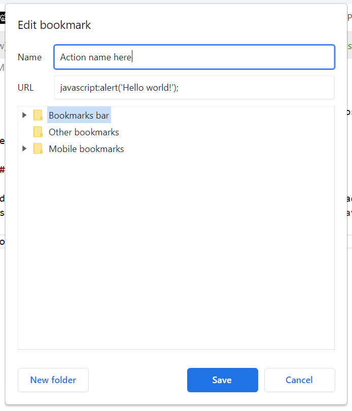

# Royal Mail Address Extractor Bookmarklet

A bookmarklet for extracting addresses from Royal Mail online postcode checker.

Tested in Chrome: 92.0.4515.159

## To use

### Create bookmarklet

Add a 'page' to your bookmarks, but instead of adding a web address, add `javascript:` to the URL field and append the script in the [./bookmarklet.js](./bookmarklet.js) file. See image below for an example bookmarklet.

### Use bookmarklet

To extract addresses, got to the [Royal Mail find an address page](https://www.royalmail.com/find-a-postcode), insert a post code and click a road name to display a list of addresses. With the list still visible, click the bookmarklet you added in the previous step to extract a list of numbers. The numbers that appear can be copied from the modal dialogue and used in the application of your choice.

Bookmarklet creation example:

